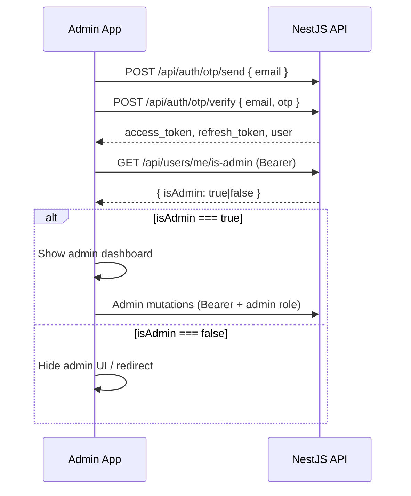

# Admin Flow — Frontend Implementation Guide

This guide documents how to build an **admin panel** (Expo, React Native, or web) against the EXETAT NestJS API. It covers authentication, route map, exact request bodies, response shapes, and the most common **HTTP 400** causes so the frontend never sends invalid payloads.

> **Related docs:** [Expo Authentication](./expo-authentication.md) (OTP login + API client), [Admin Questions](./admin-questions.md) (Langues authoring details).

---

## Table of contents

1. [How admin access works](#how-admin-access-works)
2. [API base URL & headers](#api-base-url--headers)
3. [Frontend bootstrap flow](#frontend-bootstrap-flow)
4. [Route map](#route-map)
5. [Supporting read-only routes](#supporting-read-only-routes)
6. [Admin write routes (full reference)](#admin-write-routes-full-reference)
7. [Avoiding HTTP 400 errors](#avoiding-http-400-errors)
8. [TypeScript types](#typescript-types)
9. [API client & services](#api-client--services)
10. [Screen flows](#screen-flows)
11. [Error handling](#error-handling)
12. [Testing with curl](#testing-with-curl)
13. [Checklist](#checklist)

---

## How admin access works



| Item | Value |
|------|--------|
| Global prefix | All routes start with **`/api`** |
| Auth header | `Authorization: Bearer <access_token>` |
| Admin check | `GET /api/users/me/is-admin` → `{ isAdmin: boolean }` |
| Admin role | Stored in `user_roles` table (`role: "admin"`) |
| Admin bypass | Emails in `ADMIN_EMAILS` env (or built-in defaults) also pass `RolesGuard` |
| Promote user | `POST /api/auth/make-admin` with server `ADMIN_SECRET` (setup only, not in-app) |
| Token TTL | Access **15 min**, refresh **30 days** — reuse the refresh flow from [expo-authentication.md](./expo-authentication.md) |

**Important:** Admin routes return **403 Forbidden** (not 400) when the JWT is valid but the user lacks the admin role. A **400** almost always means the **request body or query failed validation**.

---

## API base URL & headers

| Environment | Example base URL |
|-------------|------------------|
| iOS Simulator | `http://localhost:3000/api` |
| Android Emulator | `http://10.0.2.2:3000/api` |
| Physical device (same Wi‑Fi) | `http://192.168.x.x:3000/api` |
| Production | `https://your-domain.com/api` |

Every admin mutation requires:

```http
Content-Type: application/json
Authorization: Bearer <access_token>
```

Swagger (dev): `http://localhost:3000/`

---

## Frontend bootstrap flow

After OTP login (see [expo-authentication.md](./expo-authentication.md)):

1. Store `access_token` and `refresh_token` in SecureStore.
2. Call `GET /api/users/me/is-admin`.
3. If `isAdmin === true`, register admin routes/screens.
4. On every admin screen mount, optionally re-check `isAdmin` (role can be granted server-side without re-login; a new login picks up the role immediately).

```typescript
// After verifyOtp succeeds
const { isAdmin } = await api.get<{ isAdmin: boolean }>('/users/me/is-admin');
if (isAdmin) {
  router.replace('/(admin)/dashboard');
} else {
  router.replace('/(app)/home');
}
```

### Promoting the first admin (one-time setup)

Not callable from the mobile app. Run on the server or CI:

```bash
ADMIN_SECRET="your-admin-secret" BASE_URL="http://localhost:3000" ./make-admin.sh admin@example.com
```

Or:

```bash
curl -X POST http://localhost:3000/api/auth/make-admin \
  -H "Content-Type: application/json" \
  -d '{"email":"admin@example.com","adminSecret":"your-admin-secret"}'
```

The promoted user must **log in again** (or refresh token) before admin routes work.

---

## Route map

### Admin-only (JWT + admin role)

| Method | Path | Purpose |
|--------|------|---------|
| `GET` | `/api/admin/stats` | Dashboard counters + admin list |
| `POST` | `/api/categories` | Create category |
| `PATCH` | `/api/categories/:id` | Update category |
| `DELETE` | `/api/categories/:id` | Delete category (+ linked questions) |
| `POST` | `/api/exams` | Create exam year |
| `PUT` | `/api/exams/:id` | Update exam year |
| `DELETE` | `/api/exams/:id` | Delete exam year (unbinds questions) |
| `POST` | `/api/questions` | Create one question |
| `POST` | `/api/questions/bulk` | Bulk create questions (raw JSON array) |
| `PUT` | `/api/questions/:id` | Update question |
| `DELETE` | `/api/questions/:id` | Delete question |
| `POST` | `/api/admin/language/passages` | Create Langues passage |
| `POST` | `/api/admin/language/passages/:id/questions` | Add question to passage |
| `POST` | `/api/admin/language/passages/:id/questions/bulk` | Bulk add passage questions |

### Auth helpers (any logged-in user)

| Method | Path | Purpose |
|--------|------|---------|
| `GET` | `/api/users/me/is-admin` | Boolean admin flag for UI gating |
| `GET` | `/api/users/me/roles` | Raw role rows `[{ role: "admin" \| "user", ... }]` |

### Public / read-only (no admin role; used to populate admin forms)

| Method | Path | Purpose |
|--------|------|---------|
| `GET` | `/api/categories` | List categories (`?is_universal=true\|false`) |
| `GET` | `/api/categories/:id` | Single category + `question_count` |
| `GET` | `/api/categories/:id/question-count` | `{ count: number }` |
| `GET` | `/api/exams` | List exam years + `question_count` |
| `GET` | `/api/sections` | DRC section catalog (for `section_id` dropdown) |
| `GET` | `/api/sections/count` | `{ count: number }` |
| `GET` | `/api/questions` | List/filter questions (pagination) |
| `GET` | `/api/questions/:id` | Single question |
| `GET` | `/api/questions/random` | Random subset (practice preview) |

---

## Supporting read-only routes

### Sections catalog

Use this to populate the **Section** dropdown. Send the section **`id`** (not `title`) as `section_id` when creating section-specific questions.

**`GET /api/sections`**

```json
[
  { "id": "08", "title": "SOCIALE" },
  { "id": "12", "title": "MÉCANIQUE GÉNÉRALE" },
  { "id": "30", "title": "PÊCHE ET NAVIGATION" }
]
```

> Section IDs are **two-digit strings** (`"01"` … `"30"`). Do not invent slugs like `mathematique` or `mecanique-generale` — they will fail scope validation or be ignored in filters.

### Categories

**`GET /api/categories`**

```json
[
  {
    "id": "550e8400-e29b-41d4-a716-446655440000",
    "name": "Culture generale",
    "is_universal": true,
    "description": "Questions communes",
    "question_count": 120,
    "createdAt": "2026-01-01T00:00:00.000Z",
    "updatedAt": "2026-01-01T00:00:00.000Z"
  },
  {
    "id": "f47ac10b-58cc-4372-a567-0e02b2c3d479",
    "name": "Sciences",
    "is_universal": false,
    "description": "Questions par section",
    "question_count": 45,
    "createdAt": "2026-01-01T00:00:00.000Z",
    "updatedAt": "2026-01-01T00:00:00.000Z"
  }
]
```

Key field for the UI: **`is_universal`**
- `true` → Culture générale, Langues, etc. → `section_id` must be **`null`** (omit or send `null`)
- `false` → Sciences, Cours d'options → `section_id` is **required** (valid section `id` from `/api/sections`)

### Exams (year blocks)

**`GET /api/exams`**

```json
[
  {
    "id": "550e8400-e29b-41d4-a716-446655440000",
    "year": 2024,
    "question_count": 42,
    "createdAt": "2026-01-01T00:00:00.000Z",
    "updatedAt": "2026-01-01T00:00:00.000Z"
  }
]
```

`exam_id` on questions is **optional** (`null` = not tied to a year).

### Questions list (admin table)

**`GET /api/questions?category_id=&section_id=&exam_id=&year=&search=&page=1&limit=20`**

```json
{
  "data": [
    {
      "id": "550e8400-e29b-41d4-a716-446655440000",
      "text": "Le dialogue social aide surtout a :",
      "options": ["A. Aggraver", "B. Trouver des solutions"],
      "correct_answer": "B",
      "category_id": "f47ac10b-58cc-4372-a567-0e02b2c3d479",
      "exam_id": null,
      "section_id": "08",
      "explanation": "Le dialogue social cherche un compromis.",
      "createdAt": "2026-01-01T00:00:00.000Z",
      "updatedAt": "2026-01-01T00:00:00.000Z"
    }
  ],
  "meta": { "total": 100, "page": 1, "limit": 20 }
}
```

Query params are all optional. Use `page` + `limit` for pagination (not `total` in the query).

---

## Admin write routes (full reference)

### Dashboard stats

**`GET /api/admin/stats`** — Admin JWT required

```json
{
  "totalQuestions": 1250,
  "totalSections": 30,
  "totalUsers": 340,
  "totalAdmins": 2,
  "adminList": [
    { "user_id": "uuid", "display_name": "Admin Name" }
  ]
}
```

No `{ data, message }` wrapper — use the object directly.

---

### Categories

#### Create — `POST /api/categories`

```json
{
  "name": "Culture generale",
  "is_universal": true,
  "description": "Questions communes"
}
```

| Field | Type | Required | Notes |
|-------|------|----------|-------|
| `name` | string | yes | Non-empty |
| `is_universal` | boolean | yes | `true` or `false`, not `"true"` string |
| `description` | string | no | Optional helper text |

**Success (201):** category object (same shape as GET).

#### Update — `PATCH /api/categories/:id`

The server validates against the **full** `CreateCategoryDto`. Send **all** fields every time, not a partial patch:

```json
{
  "name": "Sciences",
  "is_universal": false,
  "description": "Questions specifiques a chaque section"
}
```

Sending only `{ "name": "New name" }` without `is_universal` → **400** (`is_universal must be a boolean`).

#### Delete — `DELETE /api/categories/:id`

**Success (200):**

```json
{ "message": "Category deleted successfully" }
```

Deletes all questions in that category.

---

### Exam years

#### Create — `POST /api/exams`

```json
{ "year": 2026 }
```

| Field | Type | Required | Notes |
|-------|------|----------|-------|
| `year` | **number** (integer) | yes | 1900–3000; must be unique |

Send `year` as a JSON **number**, not `"2026"` string.

**Success (201):** exam object.

**409** if year already exists: `"Cette annee d'examen existe deja"`.

#### Update — `PUT /api/exams/:id`

```json
{ "year": 2025 }
```

`year` is **required** in the body. Omitting it → **400** (`year is required`).

#### Delete — `DELETE /api/exams/:id`

**Success (200):**

```json
{ "message": "Exam year deleted successfully" }
```

Sets `exam_id = null` on linked questions (does not delete questions).

---

### Questions

#### Create — `POST /api/questions`

```json
{
  "text": "Le dialogue social aide surtout a :",
  "options": ["A. Aggraver les conflits", "B. Trouver des solutions communes"],
  "correct_answer": "B",
  "category_id": "550e8400-e29b-41d4-a716-446655440000",
  "exam_id": null,
  "section_id": null,
  "explanation": "Le dialogue social vise la cooperation."
}
```

| Field | Type | Required | Validation |
|-------|------|----------|------------|
| `text` | string | yes | Non-empty |
| `options` | string[] | yes | Min **2** items |
| `correct_answer` | string | yes | Exactly **1 character** (e.g. `"A"`, `"B"`) |
| `category_id` | UUID string | yes | Must exist |
| `exam_id` | UUID \| null | no | If set, must exist |
| `section_id` | string \| null | conditional | See [section rules](#section_id-rules) |
| `explanation` | string \| null | no | |

**Do not send** these fields on this endpoint — they are **not** in the DTO and trigger **400** (`property X should not exist`):

- `question_type`, `language`, `passage`, `passage_group`, `passage_id`

Use the Langues passage routes for reading-comprehension content.

**Success (201):** question object.

#### Bulk create — `POST /api/questions/bulk`

Body is a **raw JSON array** at the root — not wrapped:

```json
[
  {
    "text": "Question 1",
    "options": ["A. ...", "B. ..."],
    "correct_answer": "A",
    "category_id": "550e8400-e29b-41d4-a716-446655440000",
    "section_id": "08"
  },
  {
    "text": "Question 2",
    "options": ["A. ...", "B. ..."],
    "correct_answer": "B",
    "category_id": "550e8400-e29b-41d4-a716-446655440000",
    "section_id": "08"
  }
]
```

Wrong (causes **400**):

```json
{ "questions": [ /* ... */ ] }
```

#### Update — `PUT /api/questions/:id`

Partial body allowed (any subset of create fields):

```json
{
  "text": "Updated text",
  "correct_answer": "A"
}
```

Section rules are re-validated against the resolved category + section.

#### Delete — `DELETE /api/questions/:id`

**Success (200):**

```json
{ "message": "Question deleted successfully" }
```

---

### Langues passages (preferred flow)

See [admin-questions.md](./admin-questions.md) for authoring notes.

#### Create passage — `POST /api/admin/language/passages`

```json
{
  "title": "Passage Français 2026",
  "content": "Mon frère porte un parapluie noir...",
  "reading_time_minutes": 3,
  "language": "french"
}
```

| Field | Type | Required | Notes |
|-------|------|----------|-------|
| `content` | string | yes | Non-empty passage text |
| `language` | string | yes | **`"french"`** or **`"english"`** only |
| `title` | string | no | Recommended — DB expects a title |
| `reading_time_minutes` | number | no | Defaults to `3` |

Wrong language values → **400**:

- `"francais"`, `"anglais"`, `"fr"`, `"en"` are **invalid** on this endpoint

**Success (201):**

```json
{
  "data": { "id": "uuid", "title": "...", "content": "...", "language": "french", "reading_time_minutes": 3 },
  "message": "Passage created"
}
```

#### Create passage question — `POST /api/admin/language/passages/:id/questions`

```json
{
  "text": "Pourquoi porte-t-il un parapluie ?",
  "options": ["A. Il pleut", "B. Il fait beau", "C. Il neige"],
  "correct_answer": "A",
  "explanation": "Le texte mentionne un ciel couvert."
}
```

| Field | Type | Required |
|-------|------|----------|
| `text` | string | yes |
| `options` | string[] | yes (non-empty array) |
| `correct_answer` | string | yes |
| `explanation` | string | no |

**Success (201):** `{ "data": <question>, "message": "Question created" }`

#### Bulk passage questions — `POST /api/admin/language/passages/:id/questions/bulk`

Raw JSON array (same objects as single create). Returns **201** with `{ data: [...], message: "Questions created" }`.

---

## Avoiding HTTP 400 errors

The API uses a strict global `ValidationPipe`:

```typescript
whitelist: true,           // strips unknown properties
forbidNonWhitelisted: true // 400 if extra properties sent
transform: true           // coerces types where decorators allow
```

Error shape:

```json
{
  "statusCode": 400,
  "message": "Les categories specifiques doivent fournir section_id",
  "timestamp": "2026-06-05T12:00:00.000Z",
  "path": "/api/questions"
}
```

`message` can be a **string** or **string[]** (multiple validation errors).

### Top causes and fixes

| Symptom | Cause | Fix |
|---------|-------|-----|
| `property foo should not exist` | Extra field in body | Only send documented fields; remove `id`, `createdAt`, nested wrappers |
| `category_id must be a UUID` | Invalid or missing UUID | Load IDs from `GET /api/categories` |
| `correct_answer must be shorter than or equal to 1 characters` | Multi-char answer on `POST /questions` | Send single letter: `"B"` not `"B. Answer"` |
| `options must contain at least 2 elements` | Too few options | Minimum 2 options |
| `is_universal must be a boolean` | String `"true"` on category create/patch | Send JSON boolean `true` / `false` |
| `Les categories universelles ne doivent pas fournir section_id` | `section_id` set for universal category | Set `section_id: null` or omit |
| `Les categories specifiques doivent fournir section_id` | Missing section for `is_universal: false` | Pick `id` from `GET /api/sections` |
| `L'annee doit etre un entier compris entre 1900 et 3000` | Bad exam year | Send integer `year`, range 1900–3000 |
| `year is required` | Empty body on `PUT /api/exams/:id` | Always include `{ "year": N }` |
| `language must be one of the following values: french, english` | Wrong Langues language code | Use `"french"` / `"english"` on passage routes |
| Bulk import fails | Wrapped array | Send `[{...},{...}]` not `{ items: [...] }` |
| Category PATCH fails | Partial body | Send `name`, `is_universal`, and optional `description` together |

### `section_id` rules

```typescript
function buildQuestionPayload(form: QuestionForm, category: Category) {
  const payload: CreateQuestionPayload = {
    text: form.text.trim(),
    options: form.options.filter(Boolean),
    correct_answer: form.correctAnswer, // single letter
    category_id: category.id,
    exam_id: form.examId ?? null,
    explanation: form.explanation ?? null,
  };

  if (category.is_universal) {
    payload.section_id = null; // never send a section slug
  } else {
    if (!form.sectionId) {
      throw new Error('Section is required for this category');
    }
    payload.section_id = form.sectionId; // e.g. "08", "12"
  }

  return payload;
}
```

### Client-side validation (mirror server before submit)

| Rule | Check |
|------|-------|
| Options | 2–5 strings, non-empty |
| `correct_answer` | Single character A–E matching an option prefix |
| `category_id` | Valid UUID from API |
| `section_id` | Required iff `!category.is_universal`; value from sections catalog |
| `exam_id` | UUID or `null` |
| Category PATCH | Always include `name` + `is_universal` |
| Exam year | Integer 1900–3000 |
| Langues `language` | `"french"` \| `"english"` |
| No unknown keys | Strip UI-only fields (`isDirty`, `localId`, etc.) before `JSON.stringify` |

---

## TypeScript types

```typescript
// src/types/admin.ts

export type ApiError = {
  statusCode: number;
  message: string | string[];
  timestamp?: string;
  path?: string;
};

export type Category = {
  id: string;
  name: string;
  is_universal: boolean;
  description?: string | null;
  question_count?: number;
  createdAt: string;
  updatedAt: string;
};

export type ExamYear = {
  id: string;
  year: number;
  question_count?: number;
  createdAt: string;
  updatedAt: string;
};

export type Section = {
  id: string;   // "01" … "30"
  title: string;
};

export type CreateQuestionPayload = {
  text: string;
  options: string[];
  correct_answer: string;
  category_id: string;
  exam_id?: string | null;
  section_id?: string | null;
  explanation?: string | null;
};

export type CreateCategoryPayload = {
  name: string;
  is_universal: boolean;
  description?: string | null;
};

export type CreateExamPayload = {
  year: number;
};

export type LanguagePassagePayload = {
  title?: string;
  content: string;
  reading_time_minutes?: number;
  language: 'french' | 'english';
};

export type LanguageQuestionPayload = {
  text: string;
  options: string[];
  correct_answer: string;
  explanation?: string;
};

export type AdminStats = {
  totalQuestions: number;
  totalSections: number;
  totalUsers: number;
  totalAdmins: number;
  adminList: { user_id: string; display_name: string }[];
};

export type QuestionsListResponse = {
  data: Question[];
  meta: { total: number; page: number; limit: number };
};

export type Question = {
  id: string;
  text: string;
  options: string[];
  correct_answer: string;
  category_id: string;
  exam_id?: string | null;
  section_id?: string | null;
  explanation?: string | null;
  createdAt: string;
  updatedAt: string;
};
```

---

## API client & services

Reuse the authenticated `api` helper from [expo-authentication.md](./expo-authentication.md) (`Authorization` header + refresh on 401).

```typescript
// src/services/admin.service.ts
import { api } from '../lib/api';
import type {
  AdminStats,
  Category,
  CreateCategoryPayload,
  CreateExamPayload,
  CreateQuestionPayload,
  ExamYear,
  LanguagePassagePayload,
  LanguageQuestionPayload,
  QuestionsListResponse,
  Section,
} from '../types/admin';

export const adminService = {
  async isAdmin(): Promise<boolean> {
    const res = await api.get<{ isAdmin: boolean }>('/users/me/is-admin');
    return res.isAdmin;
  },

  async getStats(): Promise<AdminStats> {
    return api.get<AdminStats>('/admin/stats');
  },

  // Lookups
  getCategories: () => api.get<Category[]>('/categories'),
  getExams: () => api.get<ExamYear[]>('/exams'),
  getSections: () => api.get<Section[]>('/sections'),

  listQuestions: (params: Record<string, string | number>) =>
    api.get<QuestionsListResponse>('/questions', { params }),

  // Categories
  createCategory: (body: CreateCategoryPayload) =>
    api.post<Category>('/categories', body),

  updateCategory: (id: string, body: CreateCategoryPayload) =>
    api.patch<Category>(`/categories/${id}`, body),

  deleteCategory: (id: string) =>
    api.delete<{ message: string }>(`/categories/${id}`),

  // Exams
  createExam: (body: CreateExamPayload) =>
    api.post<ExamYear>('/exams', body),

  updateExam: (id: string, body: CreateExamPayload) =>
    api.put<ExamYear>(`/exams/${id}`, body),

  deleteExam: (id: string) =>
    api.delete<{ message: string }>(`/exams/${id}`),

  // Questions
  createQuestion: (body: CreateQuestionPayload) =>
    api.post('/questions', body),

  createQuestionsBulk: (rows: CreateQuestionPayload[]) =>
    api.post('/questions/bulk', rows),

  updateQuestion: (id: string, body: Partial<CreateQuestionPayload>) =>
    api.put(`/questions/${id}`, body),

  deleteQuestion: (id: string) =>
    api.delete<{ message: string }>(`/questions/${id}`),

  // Langues
  createPassage: (body: LanguagePassagePayload) =>
    api.post<{ data: unknown; message: string }>('/admin/language/passages', body),

  createPassageQuestion: (passageId: string, body: LanguageQuestionPayload) =>
    api.post(`/admin/language/passages/${passageId}/questions`, body),

  createPassageQuestionsBulk: (passageId: string, rows: LanguageQuestionPayload[]) =>
    api.post(`/admin/language/passages/${passageId}/questions/bulk`, rows),
};
```

---

## Screen flows

### 1) Admin gate (after login)

```
Login → GET /users/me/is-admin
  ├─ true  → Admin Dashboard
  └─ false → Student app (hide admin tab)
```

### 2) Dashboard

- **Route:** `/(admin)/dashboard`
- **Data:** `GET /api/admin/stats`
- **Actions:** navigate to Questions, Categories, Exams, Langues

### 3) Questions list → create / edit

```
Questions List
  GET /api/questions?page&limit&category_id&search
  → Create Question
      1. GET /api/categories → pick category
      2. If !is_universal → GET /api/sections → pick section (required)
      3. GET /api/exams → optional exam year
      4. Client validate (options, correct_answer, section rules)
      5. POST /api/questions
  → Edit Question
      PUT /api/questions/:id
  → Delete
      DELETE /api/questions/:id
```

### 4) Bulk import

```
Upload JSON/CSV → map columns → preview validation
  → POST /api/questions/bulk  (raw array)
  → Show success count / per-row errors from 400 message array
```

### 5) Categories CRUD

```
GET /api/categories
POST /api/categories        { name, is_universal, description? }
PATCH /api/categories/:id   send ALL fields (name + is_universal + description?)
DELETE /api/categories/:id
```

### 6) Exam years CRUD

```
GET /api/exams
POST /api/exams             { year: 2026 }
PUT /api/exams/:id          { year: 2025 }   // year required
DELETE /api/exams/:id
```

### 7) Langues authoring

```
Create Passage → POST /api/admin/language/passages
  → Passage editor
      Add question → POST .../passages/:id/questions
      Bulk add     → POST .../passages/:id/questions/bulk
```

ASCII overview:

```
Dashboard ─┬─ Questions ─── Create/Edit/Bulk
           ├─ Categories ─ CRUD
           ├─ Exams ────── CRUD
           └─ Langues ──── Passage → Questions
```

---

## Error handling

| Status | Meaning | Frontend action |
|--------|---------|-----------------|
| **400** | Validation / business rule | Show `message` (flatten array to bullet list) |
| **401** | Missing/expired JWT | Refresh token, retry once |
| **403** | Not admin | Redirect out of admin area |
| **404** | Resource not found | Toast + navigate back |
| **409** | Duplicate exam year | Ask for different year |

```typescript
function formatApiError(err: ApiError): string {
  if (Array.isArray(err.message)) return err.message.join('\n');
  return err.message;
}
```

---

## Testing with curl

```bash
API="http://localhost:3000/api"
# Obtain JWT via OTP verify first
TOKEN="eyJhbGciOiJIUzI1NiIs..."

# Admin check
curl -s "$API/users/me/is-admin" -H "Authorization: Bearer $TOKEN" | jq

# Stats
curl -s "$API/admin/stats" -H "Authorization: Bearer $TOKEN" | jq

# Lookups (no admin role needed)
curl -s "$API/categories" | jq
curl -s "$API/sections" | jq '.[0:3]'
curl -s "$API/exams" | jq

# Create question (universal category — section_id null)
curl -s -X POST "$API/questions" \
  -H "Authorization: Bearer $TOKEN" \
  -H "Content-Type: application/json" \
  -d '{
    "text": "Capitale de la RDC ?",
    "options": ["A. Lubumbashi", "B. Kinshasa"],
    "correct_answer": "B",
    "category_id": "<universal-category-uuid>",
    "section_id": null
  }' | jq

# Create section-specific question (section_id = "08" for SOCIALE)
curl -s -X POST "$API/questions" \
  -H "Authorization: Bearer $TOKEN" \
  -H "Content-Type: application/json" \
  -d '{
    "text": "Question section SOCIALE",
    "options": ["A. ...", "B. ..."],
    "correct_answer": "A",
    "category_id": "<section-specific-category-uuid>",
    "section_id": "08"
  }' | jq

# Langues passage
curl -s -X POST "$API/admin/language/passages" \
  -H "Authorization: Bearer $TOKEN" \
  -H "Content-Type: application/json" \
  -d '{"title":"FR 2026","content":"Texte...","language":"french"}' | jq
```

---

## Checklist

Before shipping the admin UI:

- [ ] `EXPO_PUBLIC_API_URL` ends with `/api`
- [ ] Every mutation sends `Content-Type: application/json` + Bearer token
- [ ] Admin screens gated on `GET /users/me/is-admin`
- [ ] Section dropdown uses `GET /api/sections` → sends `id` (e.g. `"08"`), displays `title`
- [ ] Universal categories never send `section_id`; section-specific always do
- [ ] `correct_answer` is one letter on `POST /api/questions`
- [ ] Bulk endpoints send a **root-level JSON array**
- [ ] Category `PATCH` sends `name` + `is_universal` together
- [ ] Exam `PUT` always includes `year` as integer
- [ ] Langues passages use `language: "french" | "english"`
- [ ] No extra properties in JSON bodies (no `question_type`, `passage`, etc. on `/questions`)
- [ ] 400 errors displayed from `message` field (string or array)
- [ ] 403 redirects non-admins away from admin routes

For Langues-specific authoring patterns and legacy `passage_group` imports, see [admin-questions.md](./admin-questions.md).
