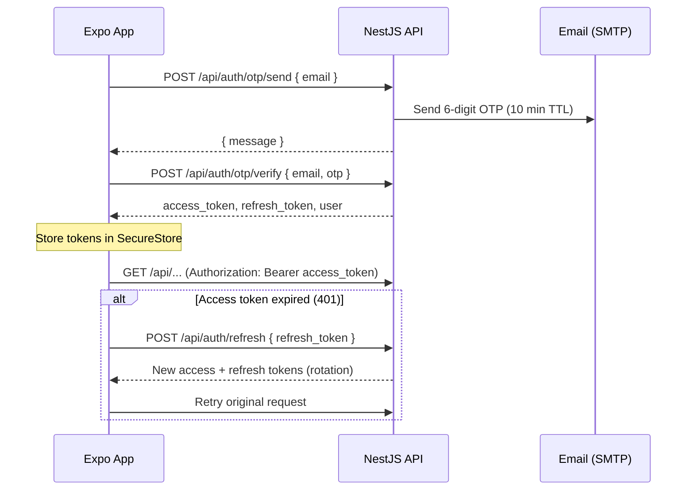

# Expo Authentication Guide (EXETAT Backend)

This guide shows how to implement **passwordless email + OTP** authentication in an **Expo (React Native)** app against this NestJS API.

> **Note:** Google OAuth routes were removed from the server. Use OTP only.

---

## Table of contents

1. [How it works](#how-it-works)
2. [API base URL](#api-base-url)
3. [Auth endpoints](#auth-endpoints)
4. [Post-login endpoints](#post-login-endpoints)
5. [Expo setup](#expo-setup)
6. [Project structure](#project-structure)
7. [Types](#types)
8. [Secure token storage](#secure-token-storage)
9. [API client with auto-refresh](#api-client-with-auto-refresh)
10. [Auth service](#auth-service)
11. [Auth context](#auth-context)
12. [UI flow](#ui-flow)
13. [Protected requests](#protected-requests)
14. [Error handling](#error-handling)
15. [Testing with curl](#testing-with-curl)
16. [Checklist](#checklist)

---

## How it works



| Item | Value |
|------|--------|
| Access token | JWT, **15 minutes**, sent as `Authorization: Bearer <token>` |
| Refresh token | Opaque string, **30 days**, stored hashed server-side |
| Refresh behavior | **Rotation** — each refresh revokes the old token and issues a new one |
| OTP | 6 digits, **10 minutes**, single-use |
| OTP rate limit | Max **3 requests per email per 10 minutes** (HTTP 429) |
| New users | Created automatically on first `otp/send` (no separate signup) |

After login, use `user.isFirstLogin` / `user.hasSelectedSections` to decide whether to show **section onboarding** (`PUT /api/user/sections`).

---

## API base URL

All routes use the global prefix **`/api`**.

| Environment | Example `EXPO_PUBLIC_API_URL` |
|-------------|-------------------------------|
| iOS Simulator | `http://localhost:3000/api` |
| Android Emulator | `http://10.0.2.2:3000/api` |
| Physical device (same Wi‑Fi) | `http://192.168.x.x:3000/api` |
| Production | `https://your-domain.com/api` |

Add to `.env` in your Expo app:

```env
EXPO_PUBLIC_API_URL=http://localhost:3000/api
```

Restart Expo after changing env vars (`npx expo start -c`).

Swagger (dev): `http://localhost:3000/` when the server runs with Swagger enabled.

---

## Auth endpoints

### 1. Request OTP

**`POST /api/auth/otp/send`**  
Alias: **`POST /api/auth/request-otp`**

**Body**

```json
{ "email": "student@example.com" }
```

**Success (200)**

```json
{ "message": "OTP envoyé avec succès" }
```

**Errors**

| Status | Meaning |
|--------|---------|
| 400 | Missing/invalid email |
| 429 | Too many OTP requests (max 3 / 10 min) |
| 500 | Email send failed |

---

### 2. Verify OTP (login)

**`POST /api/auth/otp/verify`**  
Alias: **`POST /api/auth/verify-otp`**

**Body**

```json
{
  "email": "student@example.com",
  "otp": "123456"
}
```

**Success (200)**

```json
{
  "access_token": "eyJhbGciOiJIUzI1NiIs...",
  "refresh_token": "a1b2c3...",
  "accessToken": "eyJhbGciOiJIUzI1NiIs...",
  "refreshToken": "a1b2c3...",
  "user": {
    "id": "uuid",
    "email": "student@example.com",
    "hasSelectedSections": false,
    "isFirstLogin": true,
    "section_id": null,
    "current_streak": 0,
    "longest_streak": 0,
    "last_activity_date": null
  }
}
```

The API returns **both** `snake_case` and `camelCase` token keys. Pick one style in the app and stay consistent.

**Errors**

| Status | Message (examples) |
|--------|---------------------|
| 401 | Invalid or expired OTP |
| 404 | Email not found (only if user was never created via send) |

---

### 3. Refresh tokens

**`POST /api/auth/refresh`**

**Body** (either key works)

```json
{ "refresh_token": "..." }
```

or

```json
{ "refreshToken": "..." }
```

**Success (200)** — same shape as verify OTP (new tokens + updated `user`).

**Errors**

| Status | Meaning |
|--------|---------|
| 401 | Missing, invalid, or expired refresh token |

Always persist the **new** `refresh_token` after a successful refresh (old one is revoked).

---

### 4. Minimal JWT profile (optional)

**`GET /api/auth/profile`**  
Header: `Authorization: Bearer <access_token>`

Returns `{ id, email }` from the JWT payload. Prefer **`GET /api/user/profile`** for full app state.

---

## Post-login endpoints

| Method | Path | Auth | Purpose |
|--------|------|------|---------|
| `GET` | `/api/user/profile` | Bearer | Full auth state (name, avatar, sections, streaks) |
| `PUT` | `/api/user/sections` | Bearer | Set section after onboarding |
| `GET` | `/api/users/me/is-admin` | Bearer | Admin flag |
| `GET` | `/api/users/me/roles` | Bearer | User roles |

**Set section (first login)**

```http
PUT /api/user/sections
Authorization: Bearer <access_token>
Content-Type: application/json

{ "section_id": "mecanique-generale" }
```

`section_id` is a slug from `GET /api/sections`.

---

## Expo setup

Install dependencies:

```bash
npx expo install expo-secure-store
```

Optional (recommended for navigation):

```bash
npx expo install expo-router
```

No Google Sign-In packages are required for this backend.

---

## Project structure

Suggested layout:

```
app/
  (auth)/
    email.tsx          # enter email → send OTP
    verify-otp.tsx     # enter 6-digit code
  (app)/
    _layout.tsx        # require auth
    index.tsx          # main app
  _layout.tsx          # AuthProvider + root navigator
src/
  lib/
    api.ts             # fetch wrapper + refresh
    auth-storage.ts    # SecureStore helpers
  services/
    auth.service.ts    # sendOtp, verifyOtp, refresh, logout
  context/
    AuthContext.tsx
  types/
    auth.ts
```

---

## Types

```typescript
// src/types/auth.ts

export type UserAuthState = {
  id: string;
  email: string;
  name?: string;
  avatarUrl?: string | null;
  hasSelectedSections: boolean;
  isFirstLogin: boolean;
  section_id: string | null;
  current_streak: number;
  longest_streak: number;
  last_activity_date: string | null;
};

export type AuthTokens = {
  accessToken: string;
  refreshToken: string;
};

export type LoginResponse = AuthTokens & {
  user: UserAuthState;
};

export type ApiError = {
  statusCode: number;
  message: string | string[];
  timestamp?: string;
  path?: string;
};
```

---

## Secure token storage

Never store tokens in `AsyncStorage`. Use **`expo-secure-store`**.

```typescript
// src/lib/auth-storage.ts
import * as SecureStore from 'expo-secure-store';

const ACCESS_KEY = 'exetat_access_token';
const REFRESH_KEY = 'exetat_refresh_token';

export async function saveTokens(accessToken: string, refreshToken: string) {
  await SecureStore.setItemAsync(ACCESS_KEY, accessToken);
  await SecureStore.setItemAsync(REFRESH_KEY, refreshToken);
}

export async function getAccessToken() {
  return SecureStore.getItemAsync(ACCESS_KEY);
}

export async function getRefreshToken() {
  return SecureStore.getItemAsync(REFRESH_KEY);
}

export async function clearTokens() {
  await SecureStore.deleteItemAsync(ACCESS_KEY);
  await SecureStore.deleteItemAsync(REFRESH_KEY);
}
```

---

## API client with auto-refresh

Centralize HTTP so every authenticated call attaches the JWT and refreshes on **401**.

```typescript
// src/lib/api.ts
import { clearTokens, getAccessToken, getRefreshToken, saveTokens } from './auth-storage';
import type { ApiError, LoginResponse } from '../types/auth';

const API_URL = process.env.EXPO_PUBLIC_API_URL!;

let refreshPromise: Promise<string | null> | null = null;

async function parseError(res: Response): Promise<ApiError> {
  try {
    return await res.json();
  } catch {
    return { statusCode: res.status, message: res.statusText };
  }
}

async function refreshAccessToken(): Promise<string | null> {
  const refreshToken = await getRefreshToken();
  if (!refreshToken) return null;

  const res = await fetch(`${API_URL}/auth/refresh`, {
    method: 'POST',
    headers: { 'Content-Type': 'application/json' },
    body: JSON.stringify({ refresh_token: refreshToken }),
  });

  if (!res.ok) {
    await clearTokens();
    return null;
  }

  const data: LoginResponse = await res.json();
  const access = data.accessToken ?? data.access_token;
  const refresh = data.refreshToken ?? data.refresh_token;
  await saveTokens(access, refresh);
  return access;
}

export async function apiFetch<T>(
  path: string,
  options: RequestInit = {},
  retry = true,
): Promise<T> {
  const accessToken = await getAccessToken();
  const headers = new Headers(options.headers);
  headers.set('Content-Type', 'application/json');
  if (accessToken) {
    headers.set('Authorization', `Bearer ${accessToken}`);
  }

  const res = await fetch(`${API_URL}${path}`, { ...options, headers });

  if (res.status === 401 && retry) {
    if (!refreshPromise) {
      refreshPromise = refreshAccessToken().finally(() => {
        refreshPromise = null;
      });
    }
    const newAccess = await refreshPromise;
    if (newAccess) {
      return apiFetch<T>(path, options, false);
    }
    throw await parseError(res);
  }

  if (!res.ok) {
    throw await parseError(res);
  }

  if (res.status === 204) return undefined as T;
  return res.json() as Promise<T>;
}
```

---

## Auth service

```typescript
// src/services/auth.service.ts
import { apiFetch } from '../lib/api';
import { clearTokens, saveTokens } from '../lib/auth-storage';
import type { LoginResponse } from '../types/auth';

const API_URL = process.env.EXPO_PUBLIC_API_URL!;

function normalizeLogin(data: LoginResponse): LoginResponse {
  return {
    ...data,
    accessToken: data.accessToken ?? data.access_token,
    refreshToken: data.refreshToken ?? data.refresh_token,
  };
}

export async function sendOtp(email: string) {
  const res = await fetch(`${API_URL}/auth/otp/send`, {
    method: 'POST',
    headers: { 'Content-Type': 'application/json' },
    body: JSON.stringify({ email: email.trim().toLowerCase() }),
  });
  if (!res.ok) throw await res.json();
  return res.json() as Promise<{ message: string }>;
}

export async function verifyOtp(email: string, otp: string) {
  const res = await fetch(`${API_URL}/auth/otp/verify`, {
    method: 'POST',
    headers: { 'Content-Type': 'application/json' },
    body: JSON.stringify({
      email: email.trim().toLowerCase(),
      otp: otp.trim(),
    }),
  });
  if (!res.ok) throw await res.json();
  const data = normalizeLogin(await res.json());
  await saveTokens(data.accessToken, data.refreshToken);
  return data;
}

export async function fetchUserProfile() {
  return apiFetch<LoginResponse['user']>('/user/profile');
}

export async function setUserSection(sectionId: string) {
  return apiFetch<LoginResponse['user']>('/user/sections', {
    method: 'PUT',
    body: JSON.stringify({ section_id: sectionId }),
  });
}

export async function logout() {
  await clearTokens();
}
```

---

## Auth context

```typescript
// src/context/AuthContext.tsx
import React, { createContext, useCallback, useContext, useEffect, useState } from 'react';
import * as authService from '../services/auth.service';
import { getAccessToken } from '../lib/auth-storage';
import type { UserAuthState } from '../types/auth';

type AuthContextValue = {
  user: UserAuthState | null;
  isLoading: boolean;
  signIn: (email: string, otp: string) => Promise<void>;
  signOut: () => Promise<void>;
  refreshProfile: () => Promise<void>;
};

const AuthContext = createContext<AuthContextValue | null>(null);

export function AuthProvider({ children }: { children: React.ReactNode }) {
  const [user, setUser] = useState<UserAuthState | null>(null);
  const [isLoading, setIsLoading] = useState(true);

  const refreshProfile = useCallback(async () => {
    const profile = await authService.fetchUserProfile();
    setUser(profile);
  }, []);

  useEffect(() => {
    (async () => {
      try {
        const token = await getAccessToken();
        if (token) await refreshProfile();
      } catch {
        await authService.logout();
        setUser(null);
      } finally {
        setIsLoading(false);
      }
    })();
  }, [refreshProfile]);

  const signIn = async (email: string, otp: string) => {
    const { user: loggedInUser } = await authService.verifyOtp(email, otp);
    setUser(loggedInUser);
  };

  const signOut = async () => {
    await authService.logout();
    setUser(null);
  };

  return (
    <AuthContext.Provider value={{ user, isLoading, signIn, signOut, refreshProfile }}>
      {children}
    </AuthContext.Provider>
  );
}

export function useAuth() {
  const ctx = useContext(AuthContext);
  if (!ctx) throw new Error('useAuth must be used within AuthProvider');
  return ctx;
}
```

---

## UI flow

### Screen 1 — Email

1. User enters email.
2. Call `sendOtp(email)`.
3. On success, navigate to OTP screen (pass `email` as param).
4. On **429**, show: “Too many attempts. Try again in a few minutes.”

### Screen 2 — OTP

1. 6-digit input (numeric keyboard).
2. Call `signIn(email, otp)` from context.
3. On **401**, show invalid/expired code message.
4. On success:
   - If `user.isFirstLogin` → **section picker** → `setUserSection(sectionId)` → `refreshProfile()`.
   - Else → main app.

### App shell / navigation

With **Expo Router**, gate routes in root layout:

```typescript
// app/_layout.tsx (simplified)
import { Stack, useRouter, useSegments } from 'expo-router';
import { useEffect } from 'react';
import { AuthProvider, useAuth } from '../src/context/AuthContext';

function RootNavigator() {
  const { user, isLoading } = useAuth();
  const segments = useSegments();
  const router = useRouter();

  useEffect(() => {
    if (isLoading) return;
    const inAuthGroup = segments[0] === '(auth)';
    if (!user && !inAuthGroup) router.replace('/(auth)/email');
    if (user && inAuthGroup) router.replace('/(app)');
  }, [user, isLoading, segments]);

  return <Stack screenOptions={{ headerShown: false }} />;
}

export default function Layout() {
  return (
    <AuthProvider>
      <RootNavigator />
    </AuthProvider>
  );
}
```

---

## Protected requests

Any module can call the API through `apiFetch`:

```typescript
import { apiFetch } from '../lib/api';

export function getSubjects() {
  return apiFetch<{ data: unknown[] }>('/subjects');
}
```

The client adds `Authorization` and handles token refresh automatically.

---

## Error handling

Server errors use this shape:

```json
{
  "statusCode": 401,
  "message": "Invalid or expired OTP",
  "timestamp": "2026-06-03T12:00:00.000Z",
  "path": "/api/auth/otp/verify"
}
```

`message` can be a **string** or **string[]** (validation errors).

Helper:

```typescript
export function getErrorMessage(err: unknown): string {
  if (!err || typeof err !== 'object') return 'Something went wrong';
  const e = err as { message?: string | string[] };
  if (Array.isArray(e.message)) return e.message.join(', ');
  if (typeof e.message === 'string') return e.message;
  return 'Something went wrong';
}
```

**Logout locally** when:

- Refresh returns 401
- User taps “Sign out”
- You intentionally revoke session (no server logout endpoint yet)

---

## Testing with curl

Start the server (`npm run start:dev`), then:

```bash
# 1. Request OTP
curl -X POST http://localhost:3000/api/auth/otp/send \
  -H "Content-Type: application/json" \
  -d '{"email":"test@example.com"}'

# 2. Verify (use code from email)
curl -X POST http://localhost:3000/api/auth/otp/verify \
  -H "Content-Type: application/json" \
  -d '{"email":"test@example.com","otp":"123456"}'

# 3. Protected route
curl http://localhost:3000/api/user/profile \
  -H "Authorization: Bearer <access_token>"

# 4. Refresh
curl -X POST http://localhost:3000/api/auth/refresh \
  -H "Content-Type: application/json" \
  -d '{"refresh_token":"<refresh_token>"}'
```

---

## Checklist

- [ ] `EXPO_PUBLIC_API_URL` ends with `/api`
- [ ] Tokens stored in **SecureStore** only
- [ ] Refresh on 401 with **single-flight** (one refresh at a time)
- [ ] Save **new** refresh token after every refresh (rotation)
- [ ] Onboarding when `user.isFirstLogin === true`
- [ ] Handle OTP rate limit (429) on send
- [ ] Physical device uses machine LAN IP, not `localhost`
- [ ] Android emulator uses `10.0.2.2` instead of `localhost`

---

## Related server files

| File | Role |
|------|------|
| `src/auth/auth.controller.ts` | OTP, refresh, profile routes |
| `src/auth/auth.service.ts` | OTP logic, JWT, refresh rotation |
| `src/auth/jwt.strategy.ts` | Bearer JWT validation |
| `src/users/user-auth.controller.ts` | Profile + section selection |
| `src/main.ts` | Global prefix `api`, CORS enabled |

For interactive API docs, run the server in development and open Swagger at `/`.
